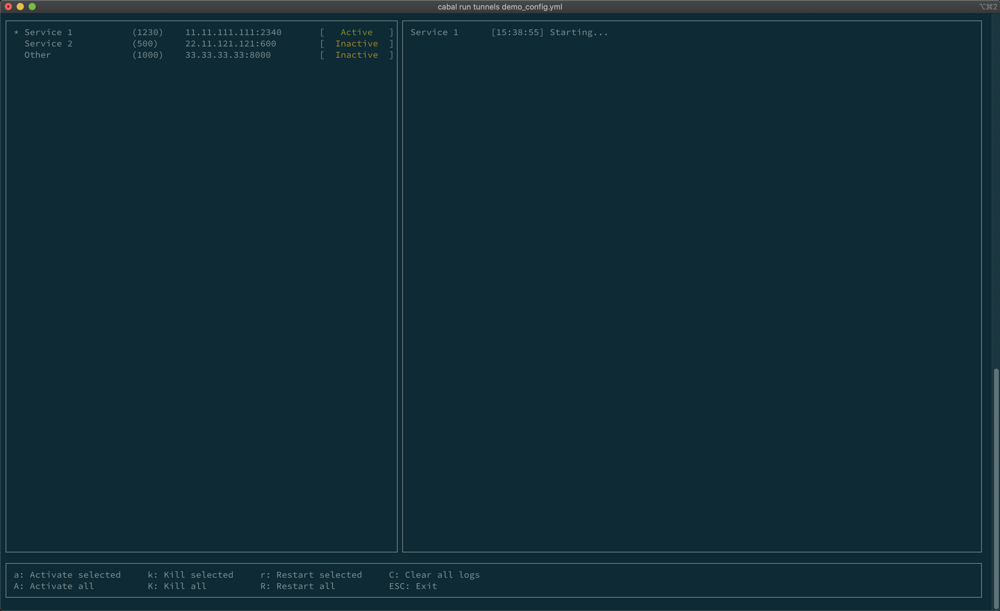

# Tunnels
SSH port tunneling with TUI

## Motivation
Some of the projects I worked on required port tunneling to handle integrations with the external services.

This involved `*.sh` file with long list of commands
`ssh -f user@some.server -L 123:internal.network.server:456 -N -o ExitOnFailure=True`
and accompanying file responsible for killing the tunnels.
Every now and then one of the tunnels would die, which required manual restart. Having to do it few times a day, five times a week got tedious pretty fast.

See  for example configuration.

## Benefits
- automatically restarts broken tunnels
- provides human readable overview of each tunnel status
- guarantees that each tunnel is started with the same flags/options
- I get to write some Haskell

## Limitations
- authentication must be key based - there is no way of providing password